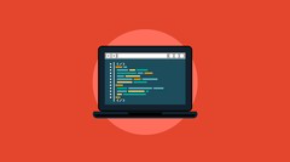

<h1 align="center">
  
</h1>

<h1 align="center">Complete C and C++ Language Course - Beginner to Advanced</h1>

## Description

Course Review "Learn C and C++ - Fundamentals of Logic Programming"

- Understand the difference between High Level X Low Level
- Understand the difference between Programming X Coding
- Define, Traverse, and Access Arrays
- Define, Traverse, and Access Vectors
- Define Constants
- Develop Menus
- Create repeating loops (While, For)
- Use Logical Connectors (AND, OR, NOT)
- Working with Simple or Compound Conditionals (IF, Switch Case)
- Do math operations
- Use different types of variables (Int, Float, Char, Boolean)

Essential:

- Review on Defining and Printing Variables
- Review of Vectors, Matrices and Loops
- How to use pointers
- How to clean the screen
- Use returnless functions
- Use return functions (Integers, Characters, Booleans)
- Using functions with single and multiple parameters passing
- Using functions with passing parameters with pointers
- Dynamic allocation of Vectors and Matrices
- Build structures (Structs)
- Reading and Writing to External Files

Creation of Games:

- Creation of Tic-Tac-Tac-Toe, Naval Battle and Hangman
- Creation of Boards
- Random Placement
- Creation of Masks
- Feedback Messages
- Modify Color in Terminal
- Play in Doubles

Data Structure:

- Simple Search
- Binary Search
- Queue Operations
- Stack Operations
- bubble sort
- Insertion Sort
- Selection Sort
- quick sort
- shell sort
- merge sort

Extra Course: 
- Extra course on Agile Project Management with Scrum.

What will be learned:

- How to develop programs using the C and C++ language
- Create your own programs using Code::Blocks
- Use different types of variables (Int, Float, Char, Boolean)
- do math operations
- Working with Simple or Compound Conditionals (IF, Switch Case)
- Use Logical Connectors (AND, OR, NOT)
- Create repeating loops (While, For)
- Develop Menus
- Define Constants
- Define, Traverse, and Access Vectors
- Define, Traverse, and Access Arrays
- how to use pointers
- How to clean the screen
- Use returnless functions
- Use return functions (Integers, Characters, Booleans)
- Using functions with single and multiple parameters passing
- Using functions with passing parameters with pointers
- Dynamic allocation of Vectors and Matrices
- Build structures (Structs)
- Reading and Writing to External Files
- Simple Search
- Binary Search
- Insert, Remove Elements in Stacks
- Insert, Remove Elements in Queues
- Sort Vectors with Bubble Sort
- Sort Arrays with Insertion Sort
- Sort Arrays with Selection Sort
- Sort Vectors with Quick Sort
- Sort Arrays with Shell Sort
- Sort Vectors with Merge Sort
- Creation of Boards
- Random Placement
- Creation of Masks
- Feedback Messages
- Modify Color in Terminal
- Play in Doubles

### 🛠 Technologies

The following tools were used in the construction of the project:

- [C](https://pt.wikipedia.org/wiki/C%2B%2B)
- [C++](https://cplusplus.com/doc/tutorial/)
- [CodeBlocks](https://www.codeblocks.org/)
